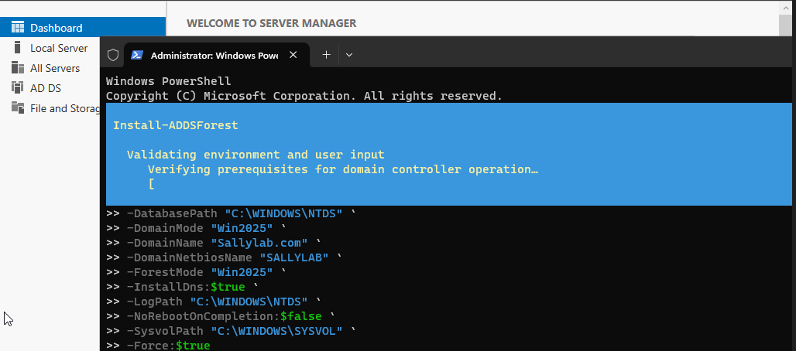

# Active-Directory and Patch Management with Windows Server 2025
Hands-on project deploying Active Directory on Windows Server 2025, joining Windows 11 client to domain, configuring GPO, and implementing patch management with Action1.
## Project objectives 
- Deploy AD DS with PowerShell
- Join Widows 11 clients to a domain,
- Implement user/group account management,
- Explore Group Policies for centralized control,
- Demonstrate Patch management with Action1.
# Active Directory Domain Service deployment using PowerShell

