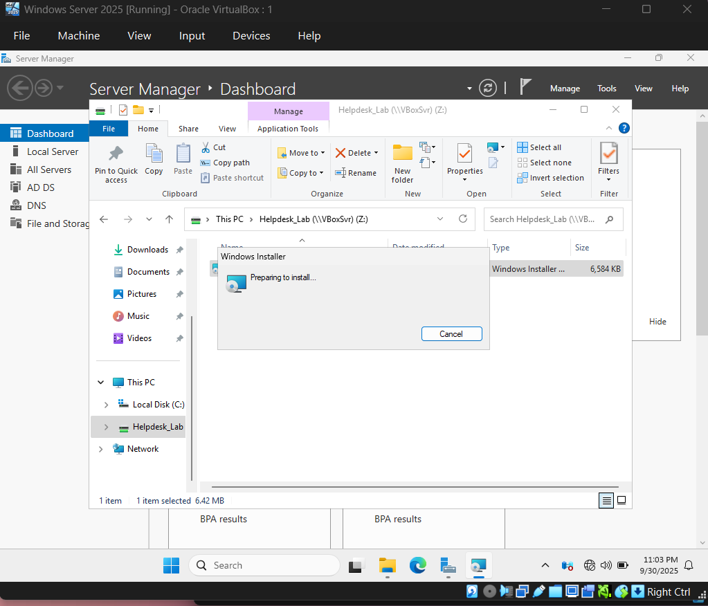
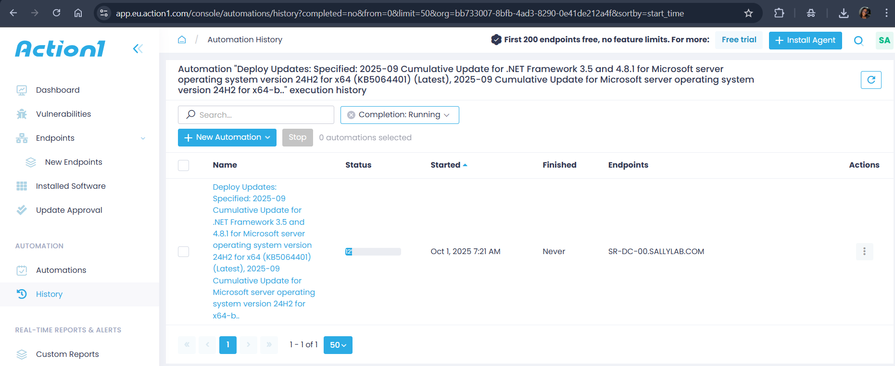
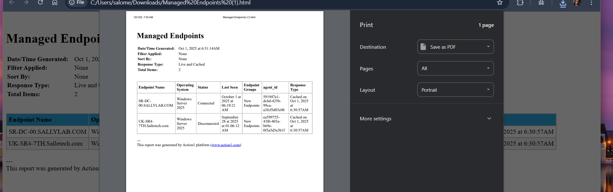

# Active-Directory and Patch Management with Windows Server 2025
This Hands-on project demostrates the deployment and managemnt of an Active Directory (AD) environment using Windows Server 2025. It covers PowerShell deployment configuration of AD DS, domain configuration, client machine domain joining, Group policy exploration, and centralized patch mangement using Action1.
## Project objectives 
- Deploy AD DS with PowerShell
- Join Widows 11 clients to a domain
- Implement user/group account management
- Explore Group Policies for centralized control
- Demonstrate Patch management with Action1.
Skills Higlighted: Windows Server Administration, Powershell, Active Directory, Group Policy, Patch Management, IT Support, System Administration
## Lab setup
Tools & Environment 
- Hypervisor: VirtualBox
- Server OS: Windows Server 2025 (Domain Controller)
- Client OS: Windows 11
- Domain name: sallylab.com
- Patch Management Tool: Action1
# Implementation Steps

## 1. Active Directory Domain Service deployment using PowerShell

## 2. Join Windows 11 Client to the Domain
- Change the Virtual Machine setting to allow Host only Adapter
- Join the Windows 11 client and Windows server IPv4 to same subnet

- Join Client Operating System to a domain
- Steps: system properties > change settings > join domain sallylab.com >Reboot > Login with domain

- Enabled Remote destktop connection > connect via IPv4 address

- RESULT

# Group Policy Overview & Management 
- Created a GPO to enforce setting across clients
- Example: Disable Clock view and Properties option
- BEFORE

- AFTER

## Patch Management with Action1
- Installed VirtualBox Guest Additions Tools for seamless integration
- Created a shared Folder to effectively access Action1 agent
- Installed Action1 agent on domain client
- 
- Deployed updates remptely through Action1 console

  - Patch Mangement Report

# Outcomes
1. Successfully deployed an AD DS environment using Powershell
2. Joined a Windows 11 client to the domain.
3. Configured and tested Group Policy Objects.
4. Demostrated Patch Mnagement workflow using Action1
# Reflection & Skills Gained 
- Hands-on experience with Active Directory & Doamin Services.
- Automated installation with PowerShell.
- Pratical understanding of user/group management & GPOs.
- Experience with third-party patch management tools.
- Detailed understanding of patch management in cybersecurity.
- Strengthened system administration & IT support skills.
# Repository Contents
- README.md > Project Documentation
- scripts/ > Powershell Scripts used for installation
- screenshots/ > Setup & results visualization
- ManagedEndpoints/ > Patch Management Report

# UP NEXT
- Add DHCP and DNS roles to the lab.
- Explore Group Policy security hardening.
- Integrate with Microsoft Intune for hybrid MDM.

   
